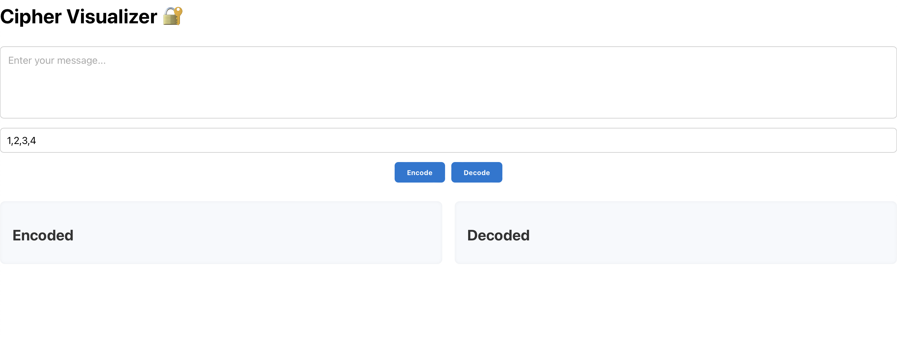

# 🔐 Cipher Visualizer

A React-based frontend application that visualizes a **Caesar-style cipher encoding and decoding process**. Built from a C++ backend logic implementation, this app demonstrates how a queue-based cipher mechanism works, showing users step-by-step how messages are transformed securely.

---

## 🧠 What It Does

- Accepts any **plaintext input** (letters only)
- Uses a customizable numeric **cipher key**
- **Encodes** messages using a shifting algorithm (case-insensitive)
- **Decodes** ciphered text back to original
- Animates each step of the transformation process
- Highlights how **queues** and **modular arithmetic** are used to secure messages

---

## 📸 Screenshots



---

## 🖥️ Live Demo

You can view the deployed app here: [https://ciphervisualizer.netlify.app](https://ciphervisualizer.netlify.app)

---

## 🚀 Features

- **Interactive UI**: Easily enter messages and see them processed in real time
- **Step-by-Step Visualization**: Watch how each character is encoded and decoded
- **Custom Cipher Key**: Modify the encryption logic dynamically
- **Responsive & Polished**: Built with modern, accessible CSS (no Tailwind used)
- **Modular Codebase**: Components split into Encoder, Decoder, QueueVisualizer, and KeyDisplay

---

## ⚙️ Getting Started

### 🛠️ Local Setup

1. **Clone the repo:**
   ```bash
   git clone https://github.com/TrishaAndres/cipher-visualizer.git
   cd cipher-visualizer
   ```
2. **Install dependencies
   ```bash
   npm install
   ```
3. **Run Locally
   ```bash
   npm start
   ```
4. **Open http://localhost:3000 to view the app.

---

## Technologies Used

React.js
HTML5 & Modern CSS
JavaScript (ES6+)
Queue Data Structure Concept
Caesar-style Cipher Encoding
